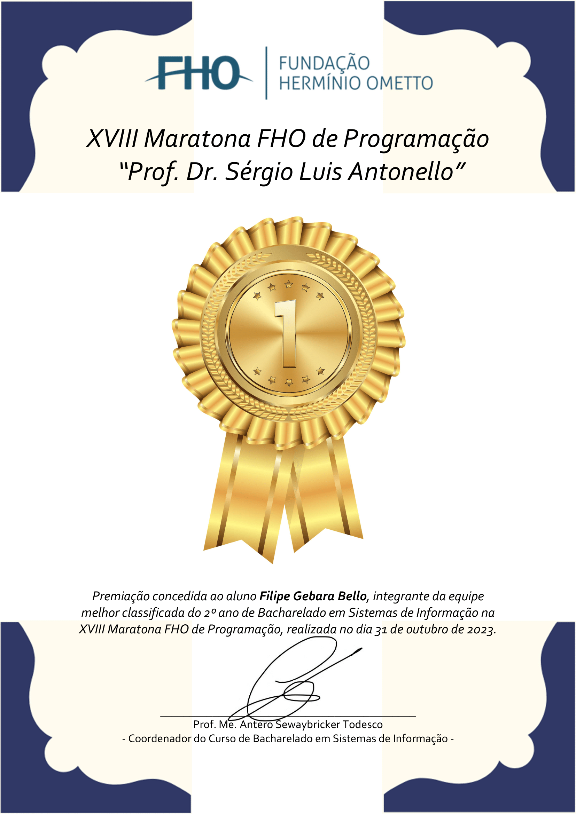

<!-- 
   ██████╗ ███████╗██╗     ██╗██████╗ ███████╗██████╗ 
  ██╔═══██╗██╔════╝██║     ██║██╔══██╗██╔════╝██╔══██╗
  ██║   ██║█████╗  ██║     ██║██████╔╝█████╗  ██████╔╝
  ██║   ██║██╔══╝  ██║     ██║██╔══██╗██╔══╝  ██╔══██╗
   ╚██████╔╝███████╗███████╗██║██║  ██║███████╗██║  ██║
    ╚═════╝ ╚══════╝╚══════╝╚═╝╚═╝  ╚═╝╚══════╝╚═╝  ╚═╝
-->

# Hi 👋, I'm Filipe Bello

**Software Developer | APIs, Integrations & Automation**

[LinkedIn](https://www.linkedin.com/in/filipe-gebara-bello-main/) · [filipegebarabello.workspace@gmail.com](mailto:filipegebarabello.workspace@gmail.com)

---

<strong>🇺🇸 English</strong> (click to expand/collapse)

### About

I build APIs, system integrations and automations that remove recurring manual work. Most of my work is in **Go**, **Python** and **TypeScript**, on top of **PostgreSQL**, **MongoDB** and **Oracle**.

### Now

**Developer at Semeq** (industrial predictive maintenance)

- APIs in Go, PHP and Python for new projects, with technical documentation
- Integration middleware between SAP and internal APIs
- Internal systems and automations for several departments
- A device diagnostics product that gives visibility into equipment health
- Logging and observability with Zabbix, Grafana and Loki

### Before

- **NetVistos** — front end and back end of a system in Next.js + Supabase with the OpenAI API, plus automations in Python and n8n.
- **ConsigBot** — Python bots for banking portals: 80% less manual effort, and run time down from 10 to 2 minutes after moving flows from Selenium to Requests.
- **Ágille Cred** — n8n automations that cut average handling time by 50%, and ConsigChat (Node.js + React), used daily by 40 people.

### Featured project

**[Voluntari-ei](https://github.com/Fipera/Voluntariei)** — mobile app that connects NGOs and volunteers by skills. Built end to end as a capstone project with React Native (Expo), Fastify, PostgreSQL, Prisma and Docker.

### Stack

| Area | Tools |
| --- | --- |
| Languages | Go, Python, TypeScript, JavaScript, PHP, SQL |
| Back end | Node.js (Fastify, Express), Flask, REST APIs |
| Data | PostgreSQL, MongoDB, Oracle, Supabase, Firebase |
| Automation | n8n, Selenium, Requests, BeautifulSoup, Pandas, Puppeteer |
| Front end & mobile | React, Next.js, React Native |
| Ops | Docker, Git, Linux, Zabbix, Grafana, Loki |

### Awards

**FHO Programming Marathon** — 1st in class in 2023 and 2024; 2nd in class and 4th overall among 62 teams in 2025.

### Fun fact

I love automating boring stuff just to save a few seconds. Totally worth it.

---

<strong>🇧🇷 Português</strong> (clique para expandir/ocultar)

### Sobre

Desenvolvo APIs, integrações entre sistemas e automações que eliminam trabalho manual recorrente. Trabalho principalmente com **Go**, **Python** e **TypeScript**, sobre **PostgreSQL**, **MongoDB** e **Oracle**.

### Hoje

**Desenvolvedor na Semeq** (manutenção preditiva industrial)

- APIs em Go, PHP e Python para projetos novos, com documentação técnica
- Middleware de integração entre SAP e APIs internas
- Sistemas e automações para diversos setores internos
- Produto de diagnóstico de dispositivos, que dá visibilidade sobre a saúde dos equipamentos
- Logs e observabilidade com Zabbix, Grafana e Loki

### Antes

- **NetVistos** — front-end e back-end de um sistema em Next.js + Supabase com a API da OpenAI, além de automações em Python e n8n.
- **ConsigBot** — robôs em Python para portais bancários: 80% menos esforço manual e tempo de execução de 10 para 2 minutos ao migrar fluxos de Selenium para Requests.
- **Ágille Cred** — automações em n8n que reduziram em 50% o tempo médio de atendimento, e o ConsigChat (Node.js + React), usado diariamente por 40 pessoas.

### Projeto em destaque

**[Voluntari-ei](https://github.com/Fipera/Voluntariei)** — app mobile que conecta ONGs e voluntários por habilidades. Construído de ponta a ponta como TCC, com React Native (Expo), Fastify, PostgreSQL, Prisma e Docker.

### Stack

| Área | Ferramentas |
| --- | --- |
| Linguagens | Go, Python, TypeScript, JavaScript, PHP, SQL |
| Back-end | Node.js (Fastify, Express), Flask, APIs REST |
| Dados | PostgreSQL, MongoDB, Oracle, Supabase, Firebase |
| Automação | n8n, Selenium, Requests, BeautifulSoup, Pandas, Puppeteer |
| Front-end e mobile | React, Next.js, React Native |
| Operação | Docker, Git, Linux, Zabbix, Grafana, Loki |

### Premiações

**Maratona de Programação FHO** — 1º da turma em 2023 e 2024; 2º da turma e 4º geral entre 62 equipes em 2025.

### Curiosidade

Adoro automatizar tarefas chatas só para economizar alguns segundos. Vale muito a pena.

---

